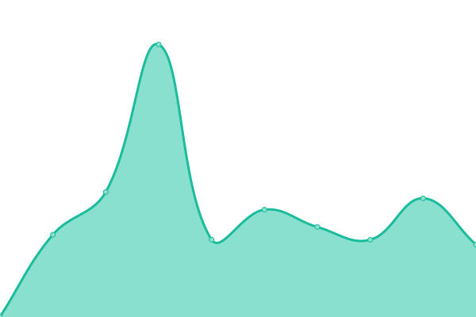

# [📈 Live Status](https://leoaslan2603.github.io/leoaslan2603.github.io): <!--live status--> **🟥 Complete outage**

This repository contains the open-source uptime monitor and status page for [Leo Aslan](https://github.com/leoaslan2603), powered by [Upptime](https://github.com/upptime/upptime).

With [Upptime](https://upptime.js.org), you can get your own unlimited and free uptime monitor and status page, powered entirely by a GitHub repository. We use [Issues](https://github.com/leoaslan2603/leoaslan2603.github.io/issues) as incident reports, [Actions](https://github.com/leoaslan2603/leoaslan2603.github.io/actions) as uptime monitors, and [Pages](https://leoaslan2603.github.io/leoaslan2603.github.io) for the status page.

<!--start: status pages-->
<!-- This summary is generated by Upptime (https://github.com/upptime/upptime) -->
<!-- Do not edit this manually, your changes will be overwritten -->
<!-- prettier-ignore -->
| URL | Status | History | Response Time | Uptime |
| --- | ------ | ------- | ------------- | ------ |
|  [Chot.Sale](https://chot.sale) | 🟥 Down | [chot-sale.yml](https://github.com/leoaslan2603/leoaslan2603.github.io/commits/HEAD/history/chot-sale.yml) | 

 1217ms
     
 | 

<a href="https://leoaslan2603.github.io/leoaslan2603.github.io/history/chot-sale">99.99%</a>
    

|  [App Chot.Sale](https://app.chot.sale) | 🟥 Down | [app-chot-sale.yml](https://github.com/leoaslan2603/leoaslan2603.github.io/commits/HEAD/history/app-chot-sale.yml) | 

 0ms
     
 | 

<a href="https://leoaslan2603.github.io/leoaslan2603.github.io/history/app-chot-sale">0.00%</a>
    

|  [TCP ping to Chot.Sale server](125.212.238.170) | 🟥 Down | [tcp-ping-to-chot-sale-server.yml](https://github.com/leoaslan2603/leoaslan2603.github.io/commits/HEAD/history/tcp-ping-to-chot-sale-server.yml) | 

 0ms
     
 | 

<a href="https://leoaslan2603.github.io/leoaslan2603.github.io/history/tcp-ping-to-chot-sale-server">0.00%</a>
    

<!--end: status pages-->

[**Visit our status website →**](https://leoaslan2603.github.io/leoaslan2603.github.io)

## 📄 License

- Powered by: [Upptime](https://github.com/upptime/upptime)
- Code: [MIT](./LICENSE) © [Leo Aslan](https://github.com/leoaslan2603)
- Data in the `./history` directory: [Open Database License](https://opendatacommons.org/licenses/odbl/1-0/)
